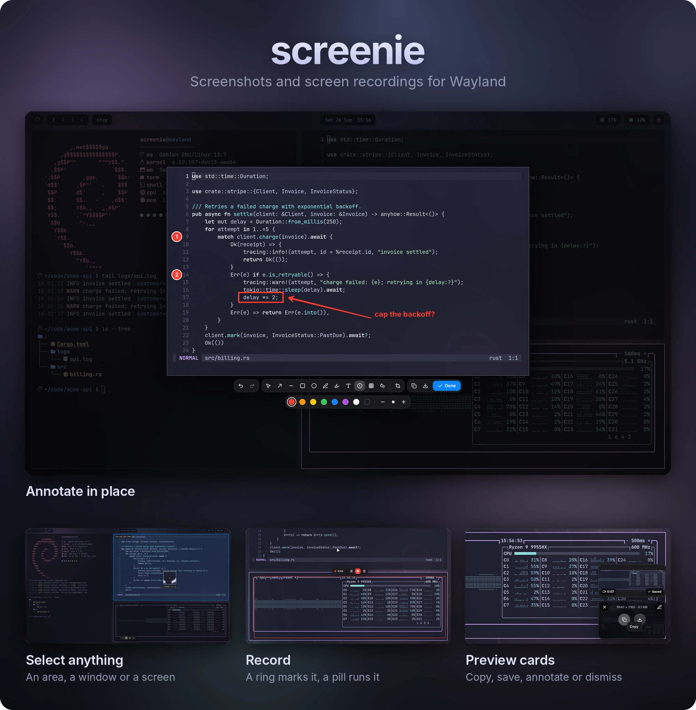
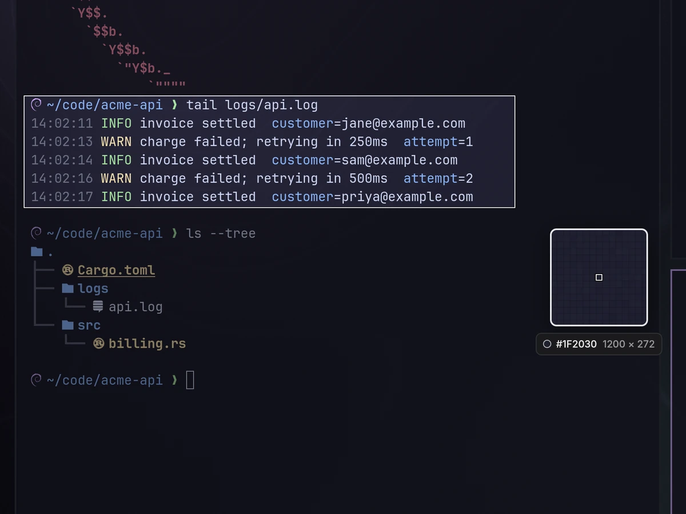
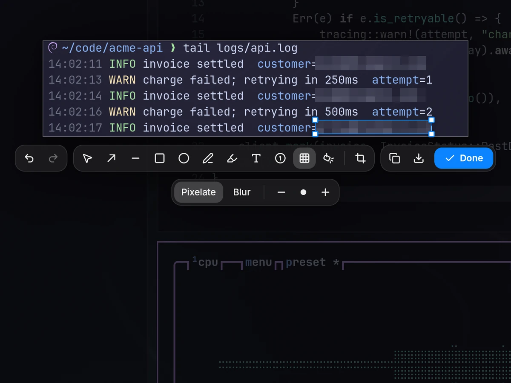

<p align="center">
  
</p>

screenie is a screenshot and screen recording app for Wayland, in the spirit of CleanShot
X. Press a key, pick what to capture, and it lands in a preview card, ready to copy, save
or annotate.

```sh
screenie shot     # screenshot an area, a window or a screen
screenie record   # record one
```

## Features

- Screenshots
  - Area, window or screen
  - Magnifier
  - Pixel-exact on fractional scaling
- Screen recording
  - Area, window or screen
  - System audio & microphone
  - GPU encoding on AMD, Intel & NVIDIA
  - Pause & resume
- Annotation
  - Markup
  - Redact
  - Numbered steps
  - Spotlight
  - Crop
- Preview cards
- Status bar integration

| | |
| :-: | :-: |
|  |  |
| Select an area | Pixelate or blur |

## Installing

Prebuilt binaries for x86_64 and aarch64 Linux are on the
[releases page](https://github.com/johnpyp/screenie/releases). They need glibc 2.35 or
newer and GStreamer's plugins, which the Arch package pulls in. On Debian or Ubuntu:

```sh
sudo apt install gstreamer1.0-plugins-good gstreamer1.0-plugins-bad \
  gstreamer1.0-plugins-ugly gstreamer1.0-libav gstreamer1.0-pulseaudio
```

For hardware-encoded recordings on AMD or Intel, also install a VA-API driver:

```sh
sudo apt install mesa-va-drivers       # AMD
sudo apt install intel-media-va-driver # Intel
```

`man screenie` documents the commands, and `man 5 screenie` the config file. After an
upgrade, the next `screenie` command picks up the new build.

### mise

```sh
mise use -g github:johnpyp/screenie
```

`mise up` upgrades it.

### Arch

From the [AUR](https://aur.archlinux.org/packages/screenie-bin), with your AUR helper:

```sh
paru -S screenie-bin
```

For hardware-encoded recordings on AMD or Intel, also install VA-API support:

```sh
sudo pacman -S gst-plugin-va                    # AMD
sudo pacman -S gst-plugin-va intel-media-driver # Intel
```

### Nix

```sh
nix profile add github:johnpyp/screenie
```

Outside NixOS, run it through [nixGL](https://github.com/nix-community/nixGL).

### Manual installation

Unpack a release into `~/.local`:

```sh
tar -xzf screenie-*-x86_64-unknown-linux-gnu.tar.gz
cp -r screenie-*/bin screenie-*/share ~/.local/
```

### Building from source

You need [Rust](https://rustup.rs) 1.98 or newer, and on Debian or Ubuntu the plugins
above plus:

```sh
sudo apt install build-essential pkg-config \
  libgstreamer1.0-dev libgstreamer-plugins-base1.0-dev \
  libxkbcommon-dev libxkbcommon-x11-dev libgbm-dev libfontconfig-dev
```

or on Arch:

```sh
sudo pacman -S --needed base-devel gstreamer gst-plugins-base-libs \
  libxkbcommon-x11 mesa fontconfig \
  gst-plugins-good gst-plugins-bad-libs gst-plugins-ugly gst-libav
```

Then build and install it, with its man pages:

```sh
git clone https://github.com/johnpyp/screenie && cd screenie
cargo build --profile dist
install -Dm755 target/dist/screenie ~/.local/bin/screenie
target/dist/screenie man ~/.local/share/man
```

To upgrade, pull, build and install again.

## Getting started

Bind screenie to keys in your compositor:

```sh
# Hyprland
bind = , Print, exec, screenie shot
bind = SHIFT, Print, exec, screenie shot screen
bind = ALT, Print, exec, screenie record

# Sway
bindsym Print exec screenie shot
bindsym Shift+Print exec screenie shot screen
bindsym Alt+Print exec screenie record
```

Press <kbd>Print</kbd>, drag over something, and a preview card appears. Hover it to
copy, save, annotate or dismiss the capture.

## Screenshots

```sh
screenie shot                      # pick an area, a window or a screen
screenie shot window               # the focused window
screenie shot window -i            # click a window
screenie shot screen               # the focused screen
screenie shot screen -i            # click a screen
screenie shot screen DP-1          # that screen
screenie shot all                  # every screen as one image
screenie shot last                 # the same region as last time
screenie shot region "100,100 800x600"
screenie shot --delay 3 --cursor
```

Choose what happens to the capture:

```sh
screenie shot --copy --no-preview  # straight to the clipboard
screenie shot --save               # save it to ~/Pictures/Screenshots
screenie shot -o ~/shot.png        # save it as ~/shot.png
screenie shot -o ~/Desktop/        # save it in ~/Desktop
screenie shot --stdout > shot.png  # write the PNG to stdout
screenie shot --edit               # open it in the editor
```

In the selector:

| Key | Action |
| --- | --- |
| Drag | Select an area |
| Shift + drag | Select a square |
| Alt + drag | Select from the center |
| Space + drag | Move the selection |
| Click | Select the window or screen under the pointer |
| <kbd>1</kbd> | Area mode |
| <kbd>2</kbd> | Window mode |
| <kbd>3</kbd> | Screen mode |
| Arrows | Nudge the selection |
| Shift + arrows | Nudge the selection by 10px |
| Ctrl + arrows | Resize the selection |
| <kbd>M</kbd> | Show or hide the magnifier |
| <kbd>Enter</kbd> | Capture |
| <kbd>Esc</kbd> | Cancel |

## Annotating

```sh
screenie shot --edit     # capture, then annotate
screenie edit shot.png   # annotate an existing image
```

You can also hover a preview card and click the pencil.

| Key | Tool | | Key | Tool |
| --- | --- | --- | --- | --- |
| <kbd>V</kbd> | Select | | <kbd>T</kbd> | Text |
| <kbd>A</kbd> | Arrow | | <kbd>N</kbd> | Numbered step |
| <kbd>L</kbd> | Line | | <kbd>B</kbd> | Pixelate or blur |
| <kbd>R</kbd> | Rectangle | | <kbd>S</kbd> | Spotlight |
| <kbd>O</kbd> | Ellipse | | <kbd>C</kbd> | Crop |
| <kbd>P</kbd> | Pen | | <kbd>H</kbd> | Highlighter |

| Key | Action |
| --- | --- |
| Ctrl + scroll | Change the size |
| <kbd>[</kbd> | Smaller |
| <kbd>]</kbd> | Bigger |
| <kbd>F</kbd> | Fill shapes, or put text on a label |
| Shift + drag | Draw straight lines and square boxes |
| Ctrl + <kbd>Z</kbd> | Undo |
| Ctrl + Shift + <kbd>Z</kbd> | Redo |
| Ctrl + <kbd>C</kbd> | Copy |
| Ctrl + <kbd>S</kbd> | Save |
| Ctrl + Shift + <kbd>S</kbd> | Save as |
| <kbd>Enter</kbd> | Done |
| <kbd>Esc</kbd> | Back out: stop typing, deselect, close |

The full list is in [the editor's README](crates/screenie-editor/README.md#keys).

The editor opens over the screen, with the capture where you took it. To use a regular
window instead:

```yaml
editor:
  mode: window
```

On a tiling compositor, float it:

```sh
# Hyprland
windowrule = float, class:dev.johnpyp.Screenie

# Sway
for_window [app_id="dev.johnpyp.Screenie"] floating enable
```

## Recording

```sh
screenie record                  # pick an area, a window or a screen, then press Record
screenie record window           # the focused window
screenie record window -i        # click a window
screenie record screen           # the focused screen
screenie record --audio --mic    # with system audio and the microphone
screenie record pause            # pause, or resume
screenie record stop             # stop and save
screenie record cancel           # stop and throw it away
```

Running `screenie record` again stops the recording, so one key starts and stops it.

After a countdown, a ring marks what's being recorded and a pill shows the time, with
pause, stop and discard buttons. Neither shows up in the video.

## Status bars and scripts

`screenie status` says what screenie is doing, and `screenie query last` what it last
captured. Fields are separated by tabs:

```console
$ screenie status
recording	1:23	/home/you/Videos/Screencasts/Recording_2026-09-26_14-02-11.mp4

$ screenie status
idle

$ screenie query last
screenshot	1790381588	/home/you/Pictures/Screenshots/Screenshot_2026-09-26_14-03-40_kitty.png
```

| State | |
| --- | --- |
| `idle` | Nothing going on |
| `selecting` | The selector is up |
| `editing` | The editor is open |
| `countdown` | A recording is about to start |
| `recording` | Recording |
| `paused` | Recording, paused |
| `saving` | Finishing a recording |

```sh
screenie status --watch             # a line per change
screenie status --json              # everything, as JSON
screenie query last recording       # the last recording
screenie query last --watch         # a line per new capture
```

A waybar module:

```jsonc
"custom/screenie": {
  "exec": "screenie status --format waybar --watch",
  "return-type": "json",
  "on-click": "screenie record stop"
}
```

Or a recording indicator for swaybar and i3blocks:

```sh
screenie status --watch | while IFS=$'\t' read -r state elapsed path; do
  case $state in
    recording) echo "● $elapsed" ;;
    paused)    echo "⏸ $elapsed" ;;
    saving)    echo "saving…" ;;
    *)         echo ;;
  esac
done
```

Commands that save a file print its path:

```console
$ screenie shot screen --save
/home/you/Pictures/Screenshots/Screenshot_2026-09-26_14-05-12.png
```

| Exit code | |
| --- | --- |
| `0` | Done |
| `1` | Cancelled |
| `2` | Error |

## Configuration

The config lives in `~/.config/screenie/config.yaml`. Every key is optional.

```yaml
ui_scale: auto            # or a size, like 1.25

screenshot:
  directory: ~/Pictures/Screenshots
  filename: "Screenshot_%Y-%m-%d_%H-%M-%S_{app}"   # {app} and {title} name the window
  after_capture: { copy: false, save: false, preview: true, edit: false }

recording:
  framerate: 60           # or native
  resolution: 1080p       # native, 720p, 1080p, 1440p or 2160p
  quality: high           # low, medium, high or lossless
  encoder: auto           # auto, hardware or software
  countdown: 3
  system_audio: false
  microphone: false

preview:
  position: bottom-right  # any corner, or top-middle, left-middle and so on
  timeout: 10             # seconds, or 0 to keep cards until dismissed

selector:
  capture_on_release: true  # false to adjust the selection, then press Enter
  dim: 0.45

editor:
  mode: overlay           # or window
  palette: ["#ff3b30", "#ff9500", "#ffcc00", "#34c759", "#0a84ff", "#af52de", "#ffffff", "#1c1c1e"]
  default_color: "#ff3b30"
  stroke_width: 4.0
  exit_on_copy: false     # close the editor after copying
  exit_on_save: false     # close the editor after saving
  confirm_discard: true   # ask before closing with unsaved annotations
```

`man 5 screenie` describes every key. It's made from
[`schema.rs`](crates/screenie-config/src/schema.rs).

### Presets

Paste one into `config.yaml` to make screenie work like another screenshot tool.

<details>
<summary>CleanShot X</summary>

```yaml
screenshot:
  after_capture: { copy: false, save: false, preview: true, edit: false }
preview:
  position: bottom-left
  timeout: 0
editor:
  mode: window
  exit_on_copy: true
```

</details>

<details>
<summary>Screendrop</summary>

```yaml
screenshot:
  after_capture: { copy: false, save: false, preview: true, edit: false }
preview:
  position: bottom-right
  timeout: 0
editor:
  mode: window
  exit_on_copy: false
  exit_on_save: false
  confirm_discard: true
```

</details>

<details>
<summary>Flameshot</summary>

```yaml
screenshot:
  after_capture: { copy: true, save: false, preview: false, edit: true }
selector:
  magnifier: false
  dim: 0.75
editor:
  mode: overlay
  exit_on_copy: true
  exit_on_save: true
  confirm_discard: false
```

</details>

## Compositor support

| Compositor | Screenshots and recording | Window picking |
| --- | :-: | :-: |
| Sway | ✅ | ✅ |
| Hyprland | ✅ | ✅ |
| niri | ✅ | ✅ |
| river | ✅ | |
| Wayfire | ✅ | |
| labwc | ✅ | |
| COSMIC | ✅ | |
| KDE Plasma | planned | |
| GNOME | planned | |

Any compositor with `ext-image-copy-capture-v1` or `wlr-screencopy` should work. More
detail is in [the compositor matrix](crates/screenie-compositor/README.md#compositor-support).

## Known limitations

- Recording a window captures just that window on Sway 1.11+. Elsewhere it records that
  part of the screen.
- A window recording on Sway shows the pointer only when it's a hardware cursor. On
  NVIDIA, or with `WLR_NO_HARDWARE_CURSORS=1`, it's left out. Record the screen to
  include it.
- A recording is only saved when it's stopped. If the daemon is killed mid-recording, the
  video is lost.
- Recording a whole screen leaves no room for the pill. Stop with your record key or
  `screenie record stop`.
- Preview cards can't be dragged into other apps yet.

## Troubleshooting

The log is at `~/.local/state/screenie/daemon.log`. For more detail, restart the daemon
with debug logging:

```sh
screenie quit
SCREENIE_LOG=debug screenie daemon
```

It logs to the terminal as well as the file.

## License

[MIT](LICENSE). The bundled [Inter](https://rsms.me/inter/) font is under the SIL Open
Font License, and the [Lucide](https://lucide.dev) icons are under ISC.
